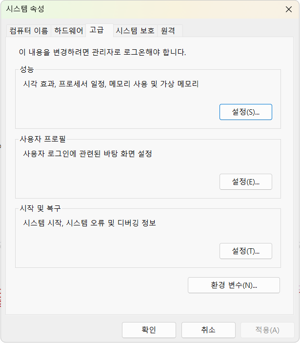

# FastAPI 데이터 연동

## 개요

- FastAPI - Python으로 API 서버를 만드는 웹 프레임워크
- API - Application Programming InterFace
- 사용자(클라이언트)가 웹, 모바일, 앱에서 요청을 하면 FastAPI 서버가 요청을 처리, 결과를 돌려줌
- JSON 타입(파이썬 딕셔너리와 유사)으로 결과 리턴
- ex)

```plaintext
사용자(클라이언트)
-> GET /students 요청
-> FastAPI 서버에서 DB를 조회
-> 학생목록 결과를 JSON으로 응답
```

- 클라이언트(요청 Request) -> 서버(응답 Response)

### FastAPI 특징

- Python 문법으로 API를 만들 수 있음
- 코드가 간결하다
- 실행 속도가 빠르다
- 테스트를 위한 UI를 자동으로 만들어 줌
- Pydantic을 사용, 요청과 응답 데이터를 검증할 수 있다
- PostgreSQL, MySQL, Oracle등 DB와 연동이 쉽다

### API 서버

클라이언트 요청을 받아 필요한 작업을 수행, 그 결과를 클라이언트에게 돌려주는 프로그램

## 개발환경 설정

### FastAPI 패키지 설치

```bash
pip install fastapi uvicorn
```

- 현재 파이썬에 fastapi와 uvicorn 패키지를 설치
- fastapi 개발 가능

```bash
pip list
```

- 패키지 설치 확인

### 기초 FastAPI 서버

- 소스 작성
- Vs Code 재시작


### 문제해결

- 설치한 uvicorn.exe 위치가 Python 설치 위치와 상이
- C:\\Users\\User\\AppData\\Roaming\\Python\\Python314\\Scripts
- (sysdm.cpl) 실행



- 환경변수 클릭


